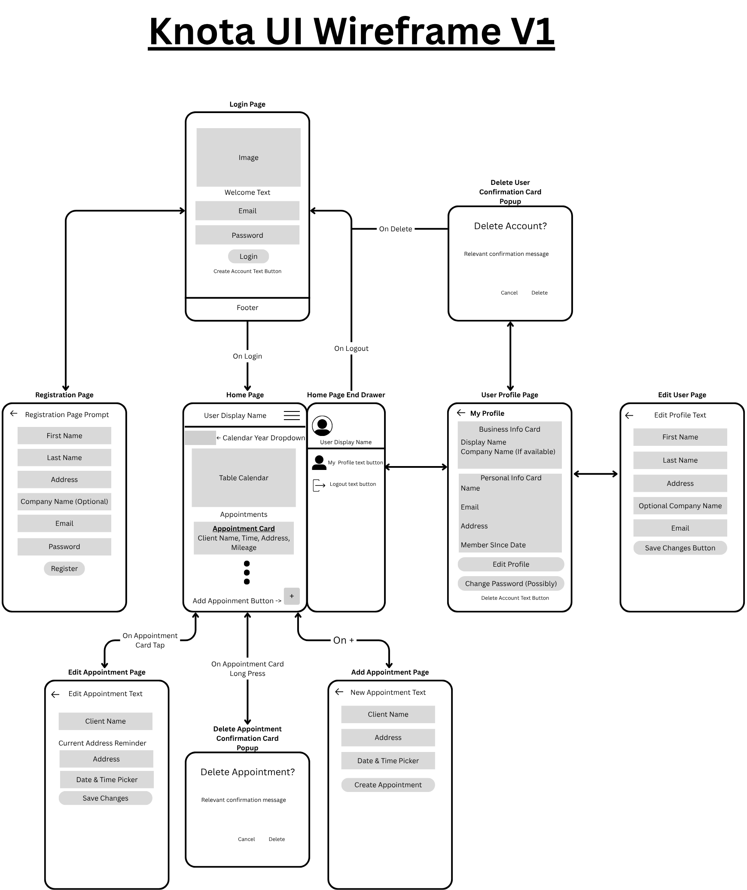
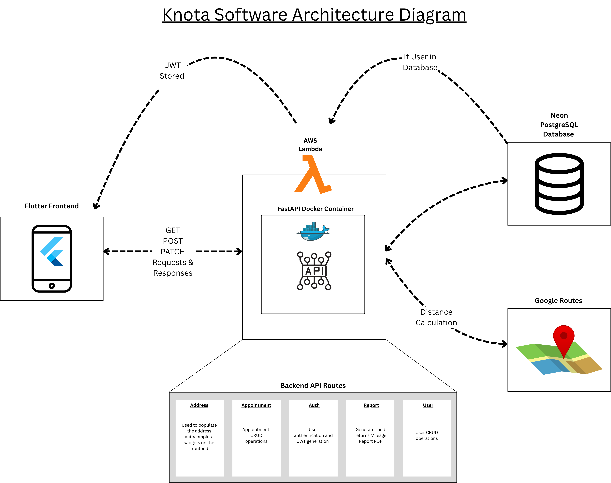

# Knota

Knota is a full-stack mileage tracking application built with a Flutter frontend and a FastAPI backend. I created this project because I did not want to continue paying for a mileage tracking service for my current massage therapy business when the problem felt solvable with software I could build myself. As a computer science graduate, I used that frustration as an opportunity to design and ship a practical product that I fully understood, owned, and could evolve end to end.

From a portfolio perspective, Knota represents more than a utility app. It reflects product thinking, API design, backend testing, database integration, containerization, and cloud deployment in a single project. From a practical perspective, it gives me a cleaner way to manage appointment-based mileage records without relying on a subscription-based third-party tool.

## Overview

Knota is designed for logging appointments, calculating travel distance, and maintaining structured mileage records through a modern client-server architecture. The project combines a cross-platform mobile-ready frontend with a Python backend, persistent storage, backend tests, and a deployment path suited for production-oriented cloud infrastructure.

A key part of the design is the use of the Google Routes API together with a cached distances table in the database. That cache helps avoid recalculating routes that have already been resolved, which was important to me both for performance and for reducing unnecessary Google API costs.

## Why I Built It

Mileage tracking felt like a straightforward problem, yet many existing solutions rely on recurring subscriptions. I wanted a tool that solved my own use case while also giving me complete control over the product experience, backend logic, database design, and deployment strategy. Knota became both a practical application and a strong end-to-end engineering project that demonstrates how I approach software design from idea to implementation.

## Highlights

- Built a complete full-stack application around a real-world personal workflow
- Developed a `FastAPI` backend with modular routing, service-layer logic, and API testing
- Integrated a `PostgreSQL` data layer hosted on `Neon.tech`
- Used the `Google Routes API` with a database-backed distance cache to avoid duplicate route calculations and reduce API costs
- Containerized the backend with `Docker` and prepared it for deployment to `AWS Lambda`
- Implemented backend test coverage for authentication, users, appointments, and reporting flows

## Architecture

Knota follows a client-server architecture. The Flutter application serves as the client layer, the FastAPI application provides the API and business logic, and PostgreSQL serves as the persistence layer. The backend is containerized with Docker and prepared for deployment to AWS Lambda, while the production database is hosted on Neon.tech.

For mileage calculations, the backend integrates with the `Google Routes API`. To control costs and avoid unnecessary third-party requests, route distances are cached in the database so previously resolved origin and destination combinations do not need to be recalculated each time.

At a high level, the request flow is:

1. The Flutter client collects user input and sends requests to the FastAPI backend.
2. The FastAPI application processes authentication, appointment, address, and reporting logic.
3. For route calculations, the backend checks the cached distances table before calling the Google Routes API.
4. The backend reads from and writes to the PostgreSQL database.
5. The containerized backend can be deployed to AWS Lambda for cloud execution.

## Tech Stack

- `Flutter` for the cross-platform frontend
- `FastAPI` for the backend API
- `PostgreSQL` as the primary database
- `Neon.tech` for managed Postgres hosting
- `Google Routes API` for distance calculation
- `Docker` for backend containerization
- `AWS Lambda` for deploying the containerized backend
- `Pytest` and FastAPI testing utilities for backend test coverage

## Features

- User authentication and account management
- Appointment creation and mileage tracking workflows
- Distance-related backend services for trip calculations
- Cached route-distance lookups to reduce duplicate API requests
- Reporting endpoints for mileage-related data retrieval
- Cross-platform Flutter client experience
- Health check endpoint for backend monitoring

## Project Structure

```text
project-knota/
├── frontend/   # Flutter application
├── backend/    # FastAPI application, tests, models, routes, and services
└── README.md
```

## Screenshots

This section can be used to showcase the application interface as the project evolves.

## UI Wireframe



## Software Architecture



## Backend Overview

The backend is implemented with `FastAPI` and organized around route modules, service layers, models, and database configuration. It exposes endpoints for authentication, users, appointments, addresses, reports, and a `/health` route for service validation. This structure keeps the application modular, readable, and easier to maintain as the project grows.

The application is also configured for serverless compatibility through `Mangum`, which makes it possible to run the containerized FastAPI backend on `AWS Lambda`.

One design decision that was especially important in this project was controlling route-computation cost. Instead of sending every mileage lookup directly to the Google Routes API, the backend stores previously calculated distances in a cache table and reuses them when the same route is requested again.

Core backend areas include:

- Authentication and authorization flows
- User profile and account management
- Appointment creation and retrieval
- Address and distance-related operations
- Route calculation and cached distance reuse
- Reporting endpoints for mileage-oriented use cases

## Database

Knota uses `PostgreSQL` as its primary relational database, with `Neon.tech` serving as the hosted database provider. In addition to core application data, the database also stores cached route distances so the system can avoid recalculating trips that have already been resolved through the Google Routes API.

For local development, the repository also includes a `docker-compose.yml` configuration that can run Postgres in a container alongside the backend service.

## Deployment

The backend is designed to be containerized and deployed to `AWS Lambda`, giving the project a lightweight cloud deployment model while still preserving the flexibility of a standard FastAPI service. This setup reflects an interest in building applications that are not only functional in development, but also thoughtfully prepared for real deployment environments.

With `Neon.tech` handling managed Postgres hosting and Docker supporting backend packaging, the deployment approach keeps the application relatively portable while aligning with modern cloud-native development practices.

## Testing

Backend testing is implemented under `backend/tests/` and covers major API areas such as:

- Authentication
- Users
- Appointments
- Reports

The test suite uses `pytest`, FastAPI's `TestClient`, and an isolated test database setup to validate backend behavior and reduce regressions as the project evolves.

This testing layer is an important part of the project because it shows a focus on backend reliability, not just feature implementation.

## What This Project Demonstrates

Knota reflects several skills that are important in production-oriented software engineering work:

- Translating a real user problem into a deployable product
- Designing a client-server application with clear separation of concerns
- Building and testing RESTful backend functionality
- Integrating a managed relational database
- Designing with cost-conscious API usage and cache-backed optimization
- Preparing a containerized backend for cloud deployment
- Maintaining a codebase that spans frontend, backend, infrastructure, and testing

## Planned Enhancements

The project roadmap is focused on both product maturity and engineering quality. Planned improvements include:

- More advanced reporting and analytics for mileage trends and usage history
- Expanded note-taking and metadata support for each appointment
- Continued refinement of the mobile and frontend user experience
- Broader automated test coverage across backend workflows
- Additional production hardening and deployment improvements
- CI/CD automation using `GitHub Actions` to run tests, validate changes, and support a more reliable deployment pipeline for the upgraded V1

## Demo Video

[Watch the demo](https://youtu.be/lcPwxDozNa4)
